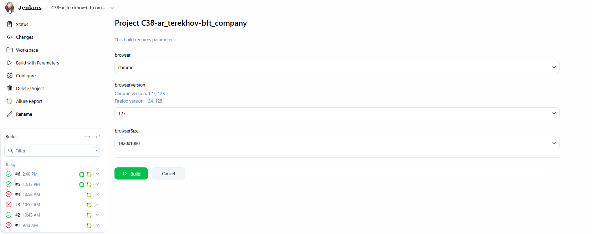
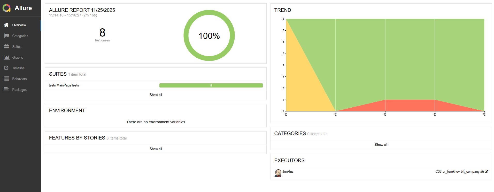
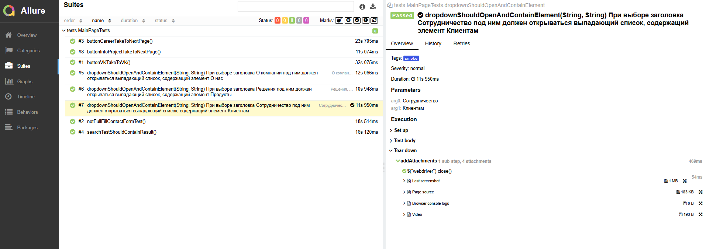
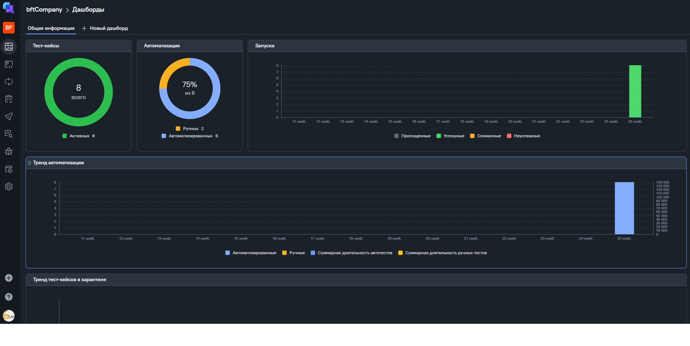
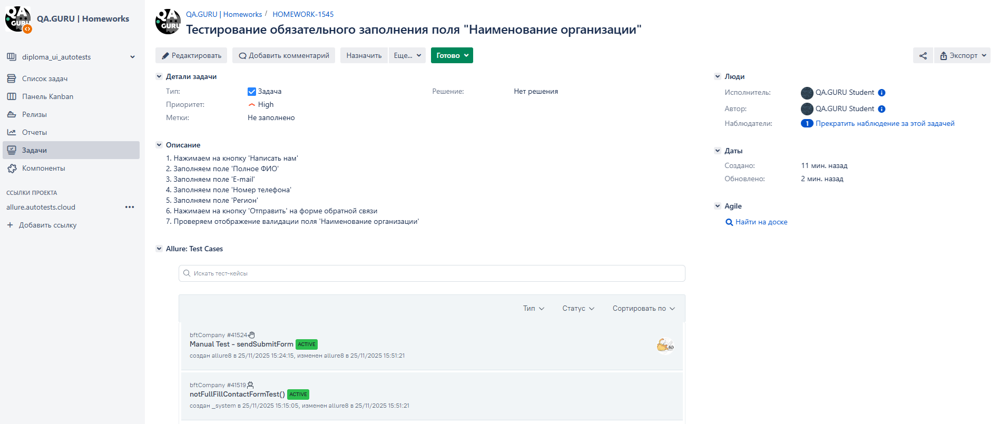
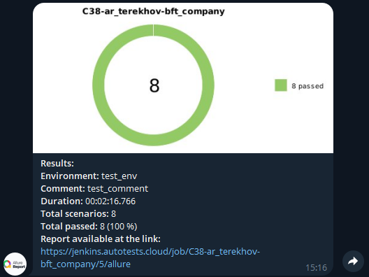
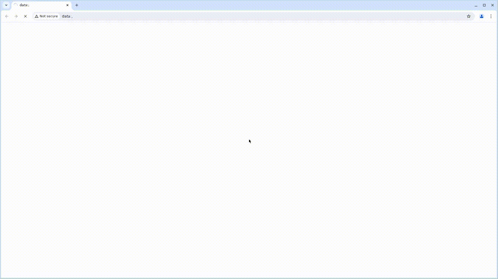

# Проект автоматизации [компании БФТ](https://bft.ru/)

> БФТ-Холдинг — одна из самых быстрорастущих ИТ-компаний. Российский разработчик программных продуктов и заказных решений для государственного сектора и бизнеса.

## **Содержание:**
____

* <a href="#tools">Используемые технологии</a>

* <a href="#jenkins">Сборка Jenkins</a>

* <a href="#console">Запуск проекта</a>

* <a href="#allure">Allure report</a>

* <a href="#allure-testops">Интеграция с Allure TestOps</a>

* <a href="#jira">Интеграция с Jira</a>

* <a href="#telegram">Уведомления в Telegram</a>

* <a href="#video">Пример видео выполнения АТ в Selenoid</a>
____
<a id="tools"></a>
## <a name="Используемые технологии">**Используемые технологии:**</a>

<p align="center">  
<a href="https://www.jetbrains.com/idea/"></a>  
<a href="https://www.java.com/"></a>  
<a href="https://junit.org/junit5/"></a>  
<a href="https://gradle.org/"></a>  
<a href="https://selenide.org/"></a>  
<a href="https://aerokube.com/selenoid/"></a>  
<a href="ht[images](images)tps://github.com/allure-framework/allure2"></a> 
<a href="https://qameta.io/"></a>   
<a href="https://www.jenkins.io/"></a>
<a href="https://www.atlassian.com/software/jira/"></a>

</p>


____
<a id="jenkins"></a>
## </a><a name="Build"></a>Сборка в [Jenkins](https://jenkins.autotests.cloud/job/C38-ar_terekhov-bft_company/)</a>
____
<p align="center">  
<a href="https://jenkins.autotests.cloud/job/C38-ar_terekhov-bft_company/"></a>  
</p>


### **Параметры сборки в Jenkins:**

- *browser (browser, default chrome)*
- *browserVersion (browser version, default 208.0)*
- *browserSize (browser window size, default 1920x1080)*
___
<a id="console"></a>
## Команды для запуска через терминал  
***Локальный запуск:***
```bash  
gradle clean smoke_test  
```

***Удаленный запуск через Jenkins:***
```bash  
clean smoke_test
"-Dbrowser=${browser}"
"-DbrowserVersion=${browserVersion}"
"-DbrowserSize=${browserSize}"
```
___
<a id="allure"></a>
## </a> <a name="Allure"></a>Allure [report](https://jenkins.autotests.cloud/job/C38-ar_terekhov-bft_company/6/allure/)</a>
___

### *Main report page*

<p align="center">  </p>

### *Suite*

<p align="center">  </p>

___
<a id="allure-testops"></a>
## </a>Интеграция с <a target="_blank" href="https://allure.autotests.cloud/project/5021/dashboards">Allure TestOps</a>
____
### *Allure TestOps Dashboard*

<p align="center">  
  
</p>  

___
<a id="jira"></a>
## </a> Интеграция с <a target="_blank" href="https://jira.autotests.cloud/browse/HOMEWORK-1545">Jira</a>
____
<p align="center">  
  
</p>

____
<a id="telegram"></a>
## </a> Уведомления в Telegram
____
<p align="center">  
  
</p>

____
<a id="video"></a>
## </a> Пример видео выполнения АТ в Selenoid
____
<p align="center">
   
</p>
